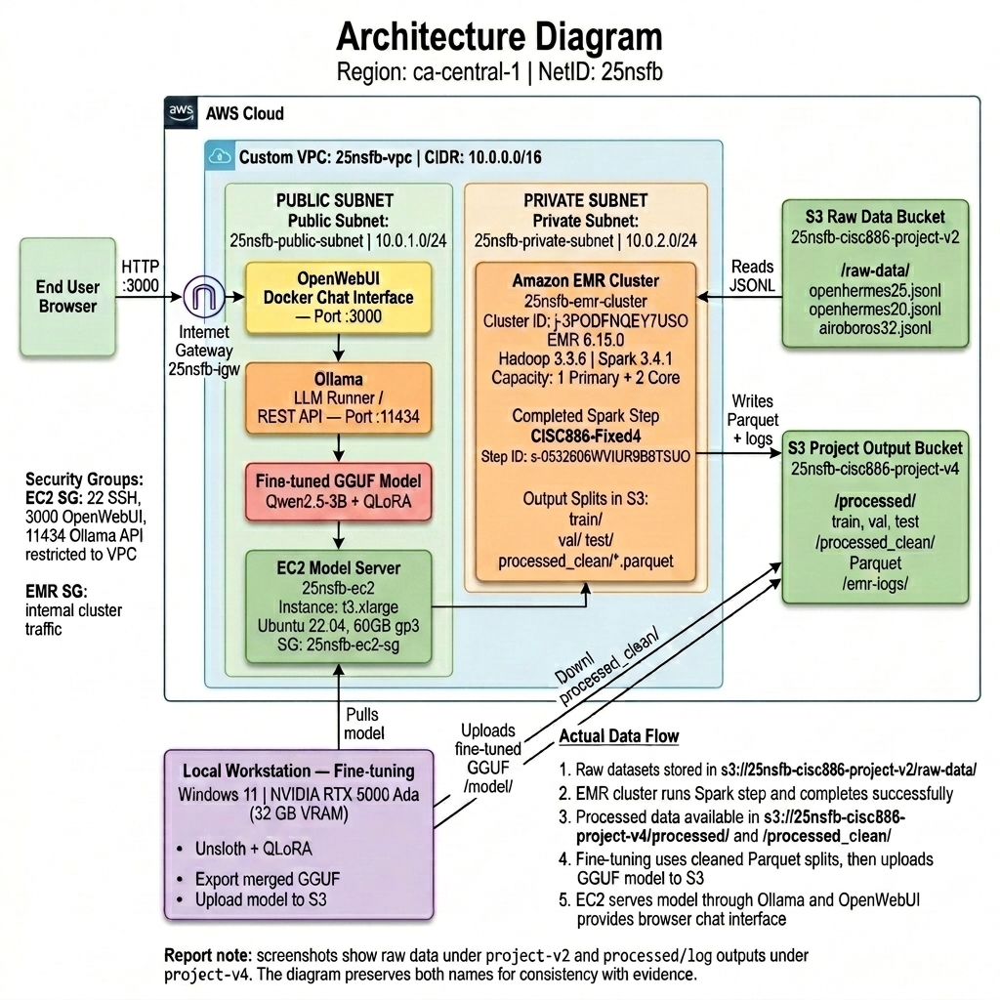

<p align="center">
  
</p>

<h1 align="center">☁️ Cloud-Based Conversational Chatbot</h1>

<p align="center">
  <strong>CISC 886 — Cloud Computing | Queen's University</strong><br/>
  Ahmed Hussain · NetID: 25nsfb · School of Computing
</p>

<p align="center">
  <a href="#-system-architecture"></a>
  <a href="#-model--dataset"></a>
  <a href="#-infrastructure-as-code"></a>
  <a href="#-data-preprocessing"></a>
  <a href="LICENSE"></a>
</p>

---

## 📋 Table of Contents

- [Overview](#-overview)
- [System Architecture](#-system-architecture)
- [Repository Structure](#-repository-structure)
- [Infrastructure as Code](#-infrastructure-as-code)
- [Data Preprocessing](#-data-preprocessing)
- [Model & Dataset](#-model--dataset)
- [Fine-Tuning](#-fine-tuning)
- [Deployment](#-deployment)
- [Web Interface](#-web-interface)
- [Prerequisites](#-prerequisites)
- [Quick Start](#-quick-start)
- [AWS Cost Summary](#-aws-cost-summary)
- [Security](#-security)
- [References](#-references)

---

## 🎯 Overview

An **end-to-end cloud-based conversational chat assistant** built on AWS. The pipeline covers the full ML lifecycle:

1. **Data Ingestion** → Raw instruction-tuning datasets uploaded to Amazon S3
2. **Distributed Processing** → PySpark on AWS EMR normalises, deduplicates, and splits the data
3. **Fine-Tuning** → QLoRA fine-tuning of Qwen-2.5-3B-Instruct on a local NVIDIA RTX 5000 Ada GPU
4. **Model Export** → Merged model exported to GGUF (Q4_K_M, 1.8 GB) and uploaded to S3
5. **Deployment** → Ollama + OpenWebUI served on EC2 `t3.xlarge` (CPU inference)
6. **User Access** → Browser-based chat interface at `http://<EC2_IP>:3000`

All infrastructure is provisioned with **Terraform** and all code is version-controlled in this repository.

---

## 🏗 System Architecture

<p align="center">
  
</p>

> **Figure 1:** Full system architecture — Custom VPC (`25nsfb-vpc`, CIDR `10.0.0.0/16`) with public subnet for EC2 model server and private subnet for EMR cluster; S3 buckets for raw data, processed splits, and model files; local workstation (RTX 5000 Ada 32 GB) for QLoRA fine-tuning; end-user browser accessing OpenWebUI over HTTP:3000.

**Data Flow:**
```
Raw Datasets → S3 /raw-data/ → EMR PySpark → S3 /processed/ (Parquet)
    → Local RTX 5000 Ada Fine-Tuning → GGUF Export → S3 /model/
    → EC2 Ollama (:11434) → OpenWebUI (:3000) → Browser
```

---

## 📂 Repository Structure

```
Cloud-based-Conversational-Chatbot/
│
├── terraform/                          # Infrastructure as Code (AWS)
│   ├── main.tf                         # Provider config (AWS ~5.0, >= 1.5.0)
│   ├── variables.tf                    # netID, region, key pair variables
│   ├── vpc.tf                          # VPC, subnets, IGW, route tables, SGs, S3
│   ├── emr.tf                          # EMR cluster, IAM roles, instance groups
│   ├── ec2.tf                          # EC2 t3.xlarge, Ubuntu 22.04, 60 GB gp3
│   ├── outputs.tf                      # ec2_public_ip, s3_bucket_name, emr_id
│   └── README.md                       # Terraform-specific documentation
│
├── processed_data_clean/               # Final cleaned Parquet splits (Train/Val/Test)
│
├── scripts/                            # Data processing & verification scripts
│   ├── fix_data.py                     # Post-Spark deduplication & leakage removal
│   ├── verify_data.py                  # Data quality verification script
│   └── generate_plots.py               # EDA visualisation generator
│
├── spark/                              # Data preprocessing pipeline
│   ├── preprocess.py                   # PySpark: normalize → dedup → filter → split
│   ├── download_datasets.py            # Downloads datasets from HuggingFace Hub
│   └── README.md                       # Spark pipeline documentation
│
├── training/                           # Model fine-tuning
│   ├── qwen25_qlora_finetuning.ipynb   # QLoRA fine-tuning (primary notebook)
│   └── README.md                       # Training documentation
│
├── report/                             # Academic report
│   ├── CISC886_Cloud_Project_Report.pdf # Compiled PDF report
│   └── figures/                        # System architecture diagrams
│       └── architecture.png
│
├── .gitignore                          # Git exclusion rules
├── LICENSE                             # MIT License
└── README.md                           # This file
```

---

## 🔧 Infrastructure as Code

All AWS resources are provisioned with **Terraform** (no manual Console clicks):

| Resource | Name | Configuration |
|----------|------|---------------|
| **VPC** | `25nsfb-vpc` | CIDR `10.0.0.0/16`, DNS enabled |
| **Public Subnet** | `25nsfb-public-subnet` | `10.0.1.0/24` — EC2 model server |
| **Private Subnet** | `25nsfb-private-subnet` | `10.0.2.0/24` — EMR cluster (isolated) |
| **Internet Gateway** | `25nsfb-igw` | Inbound user traffic + outbound updates |
| **EC2 Instance** | `25nsfb-ec2` | `t3.xlarge`, 4 vCPU, 16 GB RAM, Ubuntu 22.04 |
| **EMR Cluster** | `25nsfb-emr-cluster` | `emr-6.15.0`, Spark 3.4.1, 1 Primary + 2 Core `m5.xlarge` |
| **S3 Bucket** | `25nsfb-cisc886-project-v4` | Raw data, processed splits, model files |

**Security Groups:**

| Group | Port | Source | Purpose |
|-------|------|--------|---------|
| `25nsfb-ec2-sg` | 22/TCP | `0.0.0.0/0` | SSH administration |
| `25nsfb-ec2-sg` | 3000/TCP | `0.0.0.0/0` | OpenWebUI chat interface |
| `25nsfb-ec2-sg` | 11434/TCP | `10.0.0.0/16` | Ollama API (VPC-internal only) |
| `25nsfb-emr-*-sg` | All | Self-referencing | EMR inter-node communication |

---

## ⚡ Data Preprocessing

### Raw Data Upload to S3

Three instruction-tuning datasets were uploaded to S3 (`~2.5 GB` total):

```bash
aws s3 cp openhermes25.jsonl   s3://25nsfb-cisc886-project-v2/raw-data/
aws s3 cp openhermes20.jsonl   s3://25nsfb-cisc886-project-v2/raw-data/
aws s3 cp airoboros32.jsonl    s3://25nsfb-cisc886-project-v2/raw-data/
```

### EMR Spark Processing

The PySpark pipeline (`spark/preprocess.py`) runs on EMR and performs:

1. **Load** — Read 3 JSONL datasets from S3
2. **Normalise** — Auto-detect schema (conversations array vs. flat) → unified `{instruction, output, source}`
3. **Deduplicate** — Remove exact-match duplicates on `instruction`
4. **Filter** — Output word count ∈ [10, 2048 approx tokens], instruction ≥ 3 words
5. **Split** — 70/15/15 train/val/test via `randomSplit(seed=42)`
6. **Write** — Parquet to S3 `/processed/`

### Post-Spark Data Quality Fix

After the EMR job, a verification pass found two issues:

| Issue | Count | Resolution |
|-------|-------|-----------|
| Duplicate rows | 523 | Removed by `fix_data.py` |
| Train ↔ Val leakage | 91 instructions | Dropped from val split |

Clean splits re-uploaded to S3 `processed_clean/`:

| Split | File Size | Description |
|-------|-----------|-------------|
| `train/` | 633 MB | ~70,000 training samples |
| `val/` | 73 MB | ~15,000 validation samples |
| `test/` | 39 MB | ~15,000 test samples |

---

## 🧠 Model & Dataset

### Model: Qwen-2.5-3B-Instruct

| Property | Details |
|----------|---------|
| **Parameters** | 3 Billion (3B) |
| **Source** | [`unsloth/Qwen2.5-3B-Instruct-bnb-4bit`](https://huggingface.co/unsloth/Qwen2.5-3B-Instruct-bnb-4bit) |
| **License** | Apache 2.0 |
| **Architecture** | Transformer decoder, GQA, RoPE |
| **Chat Template** | ChatML (`<\|im_start\|>user/assistant`) |
| **Quantisation** | 4-bit QLoRA (NF4), peak < 12 GB VRAM |
| **GGUF Export** | Q4_K_M — 1.8 GB |

### Datasets

| Dataset | Source | License |
|---------|--------|---------|
| OpenHermes-2.5 | `teknium/OpenHermes-2.5` | MIT |
| OpenHermes-2.0 | `teknium/openhermes` | MIT |
| Airoboros-3.2 | `jondurbin/airoboros-3.2` | CC-BY-4.0 |

**Final split** (100,000 total after cleaning): Train 70K · Val 15K · Test 15K

---

## 🔥 Fine-Tuning

| Hyperparameter | Value | Rationale |
|---------------|-------|-----------|
| LoRA rank (r) | 32 | Strong learning signal for 2-epoch run |
| LoRA alpha | 64 | Scaling: α/r = 2 |
| Learning rate | 2e-4 | Standard for LoRA (Unsloth) |
| Batch size | 2 | Safe for Qwen-3B @ seq=1024 on 32 GB VRAM |
| Gradient accumulation | 8 | Effective batch = 16 |
| Epochs | 2 | 2 full passes over 20,000 training samples |
| Max seq length | 1024 | Covers > 95% of examples |
| Optimizer | AdamW 8-bit | Reduced memory vs. standard |

**Hardware:** Local workstation · NVIDIA RTX 5000 Ada (32 GB VRAM) · Windows 11 · CUDA 12.1
**Duration:** ~6 hours for 20,000 samples, 2,478 steps
**Final training loss:** < 0.7

### Why Not Gemma-2 2B?

The original plan used **Gemma-2 2B Instruct**. Training was abandoned after:
1. Cross-entropy loss plateaued at ~4.98 (vs. < 0.7 for Qwen-2.5)
2. Gemma-specific chat template incompatible with Unsloth on Windows
3. LoRA → GGUF merge export failed reproducibly

Switching to Qwen-2.5-3B-Instruct resolved all three issues immediately.

---

## 🚀 Deployment

### Ollama Model Server

```bash
# Install Ollama on EC2
curl -fsSL https://ollama.com/install.sh | sh
sudo systemctl enable ollama && sudo systemctl start ollama

# Download GGUF model from S3
aws s3 cp s3://25nsfb-cisc886-project-v4/model/ ~/models/ --recursive

# Create Modelfile and register
cat > ~/Modelfile << 'EOF'
FROM /home/ubuntu/models/unsloth.Q4_K_M.gguf
PARAMETER temperature 0.7
PARAMETER top_p 0.9
PARAMETER num_ctx 2048
PARAMETER repeat_penalty 1.1
SYSTEM "You are a helpful assistant fine-tuned on high-quality instruction data."
EOF

ollama create 25nsfb-qwen25-finetuned -f ~/Modelfile
```

### API Verification

```bash
curl http://localhost:11434/api/generate \
  -d '{
    "model":  "25nsfb-qwen25-finetuned",
    "prompt": "What is the difference between machine learning and deep learning?",
    "stream": false
  }'
```

---

## 🌐 Web Interface

### OpenWebUI (Auto-starts on reboot)

```bash
# Install Docker
sudo apt-get install -y docker.io
sudo systemctl enable docker && sudo systemctl start docker

# Deploy OpenWebUI with auto-restart policy
docker run -d \
  --name open-webui \
  --restart always \
  --network host \
  -v open-webui:/app/backend/data \
  -e OLLAMA_BASE_URL=http://localhost:11434 \
  ghcr.io/open-webui/open-webui:main

# Access: http://<EC2_PUBLIC_IP>:3000
```

The `--restart always` Docker policy ensures OpenWebUI restarts automatically after any OS reboot. Combined with `sudo systemctl enable docker`, the full stack (Docker → OpenWebUI → Ollama) auto-starts on boot.

---

## ⚙️ Prerequisites

| Tool | Version | Install |
|------|---------|---------|
| Terraform | ≥ 1.5.0 | [hashicorp.com](https://developer.hashicorp.com/terraform/install) |
| AWS CLI | v2 | [aws.amazon.com/cli](https://aws.amazon.com/cli/) |
| Python | ≥ 3.10 | [python.org](https://www.python.org) |
| NVIDIA GPU | RTX 5000 Ada or equivalent (≥ 16 GB VRAM) | Local workstation |

```bash
# Python dependencies (local machine)
pip install datasets huggingface_hub boto3 pandas pyarrow
```

---

## 🚀 Quick Start

```bash
# 1. Clone the repository
git clone https://github.com/AhmedAbdelhamed01/AWS-EMR-QLoRA-LLM-Serving.git
cd AWS-EMR-QLoRA-LLM-Serving

# 2. Provision AWS infrastructure
cd terraform
terraform init
terraform plan
terraform apply

# 3. Download datasets and upload to S3
cd ..
python spark/download_datasets.py
aws s3 cp raw_data/ s3://25nsfb-cisc886-project-v4/raw-data/ --recursive

# 4. Upload PySpark script and submit EMR job
aws s3 cp spark/preprocess.py s3://25nsfb-cisc886-project-v4/scripts/preprocess.py
EMR_ID=$(cd terraform && terraform output -raw emr_cluster_id)
aws emr add-steps --cluster-id $EMR_ID \
  --steps '[{
    "Type": "Spark",
    "Name": "CISC886-Preprocess",
    "ActionOnFailure": "CONTINUE",
    "Args": ["s3://25nsfb-cisc886-project-v4/scripts/preprocess.py"]
  }]'

# 5. Run fine-tuning notebook locally (training/qwen25_qlora_finetuning.ipynb)

# 6. Deploy model on EC2 (see Deployment section above)

# 7. Tear down when done
cd terraform && terraform destroy
```

---

## 💰 AWS Cost Summary

| Service | Configuration | Duration | Unit Rate | Est. Cost |
|---------|--------------|----------|-----------|-----------|
| EMR Master | `m5.xlarge` | ~2 hr | $0.192/hr | $0.38 |
| EMR Core ×2 | `m5.xlarge` ×2 | ~2 hr | $0.384/hr | $0.77 |
| EC2 Model Server | `t3.xlarge` (CPU) | ~6 hr | $0.166/hr | $1.00 |
| S3 Storage | ~15 GB total | 1 month | $0.023/GB | $0.35 |
| Data Transfer | S3 ↔ EMR, EC2 | — | $0.09/GB | $0.18 |
| **Total Estimate** | | | | **$2.68** |

**Cost-saving measures:**
- 🔥 EMR terminated immediately after preprocessing (~2 hours)
- 🆓 Fine-tuning on local workstation (zero AWS GPU cost)
- ⏸️ EC2 stopped between testing sessions
- 📦 S3 is the only resource active at submission time

---

## 🔒 Security

- All resources prefixed with `25nsfb-` (NetID)
- Ollama API port `11434` restricted to VPC CIDR only (`10.0.0.0/16`)
- SSH key **never committed** (in `.gitignore`)
- Terraform state files **never committed** (contain sensitive resource IDs)
- AWS credentials managed via CLI profiles, not hardcoded

---

## 📚 References

| Resource | Link |
|----------|------|
| Unsloth Fine-tuning | [github.com/unslothai/unsloth](https://github.com/unslothai/unsloth) |
| Ollama | [ollama.com](https://ollama.com) |
| OpenWebUI | [github.com/open-webui/open-webui](https://github.com/open-webui/open-webui) |
| AWS EMR Documentation | [docs.aws.amazon.com/emr](https://docs.aws.amazon.com/emr/) |
| Terraform AWS Provider | [registry.terraform.io](https://registry.terraform.io/providers/hashicorp/aws/latest) |
| Qwen-2.5 Model | [huggingface.co/Qwen](https://huggingface.co/Qwen/Qwen2.5-3B-Instruct) |
| OpenHermes-2.5 Dataset | [huggingface.co/teknium](https://huggingface.co/datasets/teknium/OpenHermes-2.5) |

---

<p align="center">
  <sub>Built with ❤️ for CISC 886 — Cloud Computing · Queen's University · 2026</sub>
</p>
